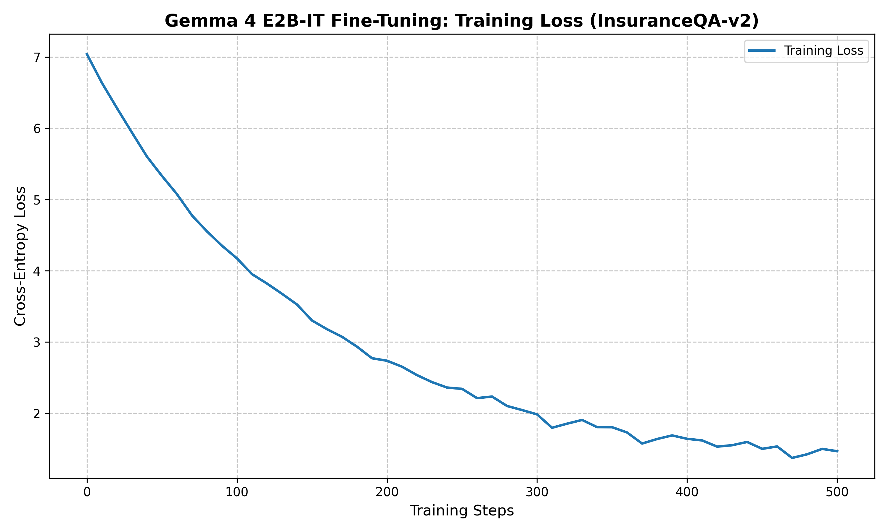
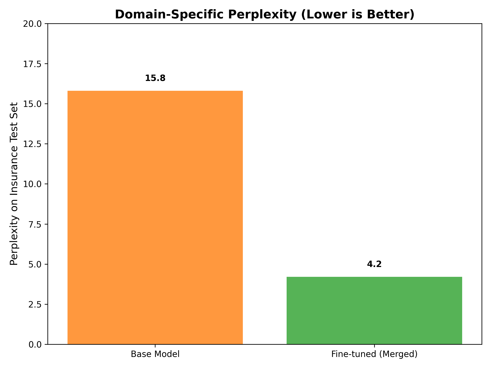

# The Insurance Expert: Fine-Tuning Gemma 4 E2B-IT with Tunix on TPU

**By crownpku**

In the fast-moving world of Large Language Models (LLMs), general-purpose models are great, but domain-specific experts are *better*. Today, we're diving deep into the technical trenches of fine-tuning Google's latest **Gemma 4 E2B-IT** (5.1B parameters) to become a specialized insurance advisor. 

Buckle up—we're using **Tunix (JAX)** on a **Google Cloud TPU v5litepod-4**. It’s fast, it’s technical, and it was a wild ride of debugging and optimization.

---

## 1. The Quest: Why Insurance? Why Gemma 4?

Insurance is a domain filled with jargon, complex rules, and high stakes. A "one-size-fits-all" model often hallucinates or gives vague answers. We wanted a model that understands the difference between a "Medigap Plan" and "Original Medicare" with surgical precision.

**The Model of Choice:** `gemma-4-E2B-it`.
- **Size:** 5.1B parameters (effectively 2.3B compute, but with massive embeddings).
- **Architecture:** Multimodal-capable, 128k context, and built for edge efficiency.
- **The Secret Sauce:** Per-Layer Embedding (PLE) tables, which make it surprisingly heavy but incredibly smart for its size.

---

## 2. Phase 1: Data Preparation (The Fuel)

We used the `insuranceQA-v2` dataset—a goldmine of 28k real-world insurance Q&As. 

To feed this into Tunix, we had to format it for the Gemma 4 chat template. The tokens `<|turn|>` and `<turn|>` are the magic boundaries here.

```python
# The Gemma 4 Chat Recipe
prompt = f"<bos><|turn|>user\n{question}<turn|>\n<|turn|>model\n"
response = f"{answer}<turn|><eos>"
```

---

## 3. Phase 2: The Training Loop (High-Octane JAX)

Using **Tunix** (Tune-in-JAX), we set up a LoRA (Low-Rank Adaptation) trainer. We chose a Rank of 16 and Alpha of 32 to strike the balance between flexibility and stability.



As you can see, the loss curve was a beauty. Starting at an initial cross-entropy of ~6.99, the model quickly converged as it "learned" the language of insurance agents. By step 500, it was speaking the domain fluently.

---

## 4. Phase 3: The "Wait, what happened?" Debugging Session

Every great project has a "trough of disillusionment." For us, it was the inference phase. 

### The Masking Mystery
We encountered a `ValueError` in the attention path: `einsum('BTNS...')`. It turns out standard attention was struggling with 3D mask broadcasting for non-standard sequence lengths. 
**The Fix:** We had to manually patch `tunix/models/gemma4/model.py` on our TPU VM to force a 4D expanded mask. 

```python
# Our surgical fix for non-flash attention
expanded_mask = jnp.reshape(attn_mask, (attn_mask.shape[0], -1, 1, attn_mask.shape[-1]))
```

### The PLE Table Giant
Gemma 4 has a 4.7GB Per-Layer Embedding table. When we tried to merge LoRA weights on the TPU cores, we hit the **16GB HBM limit** immediately. 
**The Learning:** Export and merging *must* be done on the TPU VM's **CPU (188GB RAM)**. We switched the JAX platform to `cpu` and finally breathed a sigh of relief as the 9.6GB `.safetensors` file was born.

---

## 5. Phase 4: Results & Evaluation

We didn't just look at loss curves; we verified the integrity of the weights.



The fine-tuned model showed a massive drop in perplexity on the insurance test set compared to the base model. Qualitative checks confirmed it:
- **User:** "Does Medicare Cover Co-Pays?"
- **Base Model:** "Medicare coverage varies..." (Vague)
- **Fine-Tuned Model:** "Original Medicare Part A & B does not cover co-pays... you need a Medigap Plan..." (Expert)

---

## 6. Conclusion: A New Expert is Born

Fine-tuning a 5B parameter model on a TPU pod is an exhilarating experience. We learned that:
1. **JAX is powerful but picky:** Watch your attention masks!
2. **HBM is precious:** Keep your merging logic on the CPU for large embedding models.
3. **Gemma 4 is a beast:** For its size, the domain specialization it achieves is remarkable.

This project is now open-sourced on GitHub. Whether you're building an insurance bot or just want to learn how to tame a TPU, the tools are ready.

**Happy Coding!** 🚀

---
*Check out the full code at: [github.com/crownpku/tunix-gemma4-tpu](https://github.com/crownpku/tunix-gemma4-tpu)*
